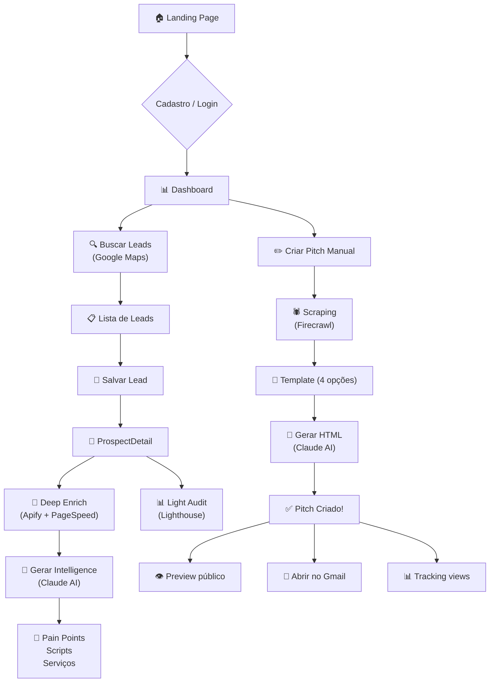
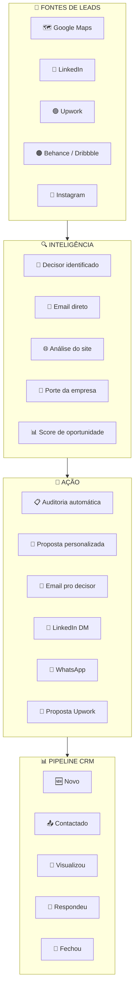
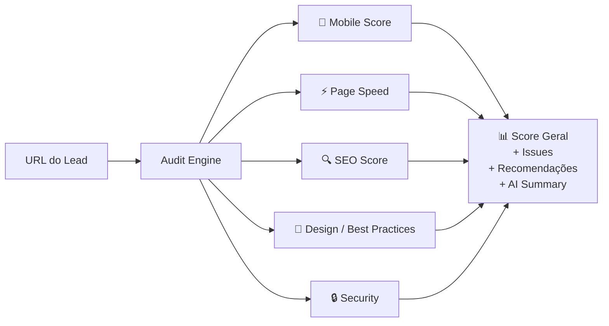
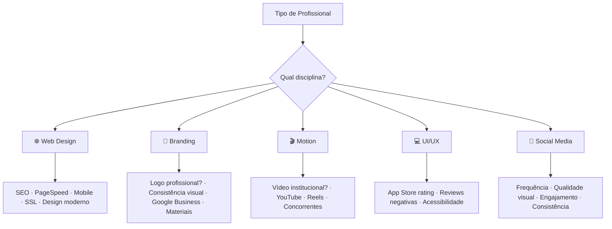
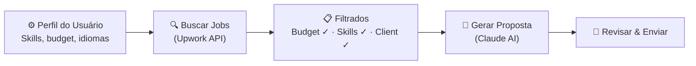

# PRD — BirdBox v3.0: North Star

**Version:** 3.0
**Date:** 2026-02-25
**Stack:** React + TypeScript + Tailwind CSS + Supabase + Deno Edge Functions

---

> **Filosofia Central**
>
> *"O produto não faz o trabalho criativo. O produto faz o criativo encontrar e convencer os clientes certos."*

---

## 1. Visão & Reposicionamento

### O que mudou — e por quê

O modelo original (v1.0) enviava ao lead um site gerado automaticamente por IA como argumento de venda. O problema: ao mostrar que a IA faz um site em 60 segundos, o produto desvalorizava exatamente o serviço que o designer queria vender. O lead pensava "por que pagar R$5.000 se IA faz grátis?".

O pivô não é contra o uso de IA. É contra usar IA como *substituto público* do trabalho criativo. O BirdBox usa IA internamente — para gerar inteligência de vendas, scripts, propostas, análises — mas o que o cliente final vê é o portfólio e o diagnóstico fundamentado do profissional, não um site gerado em segundos.

| Aspecto | Antes (v1.0) | Agora (v3.0 North Star) |
|---|---|---|
| **Produto** | Gerador de pitch websites com IA | Central de inteligência comercial |
| **O que o lead recebe** | Site gerado por IA | Diagnóstico com dados reais |
| **Argumento de venda** | "Fiz um site bonito pra você" | "Seu site tem 5 problemas — aqui os dados" |
| **Fonte de leads** | Só Google Maps | Maps + LinkedIn + Upwork + Instagram + Behance |
| **Contato** | info@empresa.com | Email direto do decisor |
| **Canais** | 1 email manual | Sequência multi-canal automatizada |
| **Follow-up** | Zero | 5-7 touches automáticos |
| **Pipeline** | Nenhum | CRM Kanban integrado |

---

## 2. Personas — Quem Usamos o BirdBox

O produto serve **5 tipos de profissionais criativos**, cada um buscando um tipo diferente de oportunidade:

| Persona | Busca por | Tipo de Auditoria |
|---|---|---|
| 🌐 **Web Designer** | Empresas com sites ruins, antigos ou sem mobile | SEO, Page Speed, Mobile, Design moderno, SSL |
| 🎨 **Brand Designer** | Empresas sem identidade visual profissional | Consistência de marca, logo, presença online, materiais |
| 🎬 **Motion Designer** | Empresas que precisam de vídeo institucional ou conteúdo | Presença em vídeo, YouTube, reels, concorrentes |
| 💻 **UI/UX Designer** | Apps e SaaS com UX fraca ou reviews negativas | App Store rating, reviews, fluxos, acessibilidade |
| 📱 **Social Media Manager** | Empresas com presença fraca ou inconsistente | Frequência de posts, qualidade visual, engajamento |

---

## 3. Estado Atual — O Que Existe Hoje

### Fluxo implementado



### Status de implementação atual

| Módulo / Feature | Status | Notas |
|---|---|---|
| Auth (Supabase email/password) | ✅ Implementado | |
| Landing Page | ✅ Implementado | |
| Dashboard com métricas | ✅ Implementado | |
| Busca de Leads (Google Maps Places API) | ✅ Implementado | Timeout 150s pendente |
| Prospects Pipeline (lista + detalhe) | ✅ Implementado | 4 abas |
| Lead Enrichment (Apify multi-source) | ✅ Implementado | |
| Decision Makers (LinkedIn via Apify) | ✅ Implementado | |
| AI Sales Intelligence (Claude) | ✅ Implementado | |
| Website Audit (PageSpeed/Lighthouse) | ✅ Implementado | |
| Pitch Creation — scrape + template + HTML | ✅ Implementado | Fluxo legado mantido |
| Preview público `/p/:id` | ✅ Implementado | |
| Feedback do lead no pitch | ✅ Implementado | |
| Tracking de views | ✅ Implementado | |
| i18n PT-BR / English | ✅ Implementado | ~99% cobertura |
| Email — abrir no Gmail | 🔄 Parcial | Não envia diretamente |
| Gmail OAuth completo | ⬜ Pendente | Banco pronto |
| warmup.io dashboard | ⬜ Pendente | Banco pronto |
| Analytics dashboard | ⬜ Pendente | Rota existe, Coming soon |
| Proposal Builder | ⬜ Pendente | North Star |
| Pipeline CRM (Kanban) | ⬜ Pendente | North Star |
| Upwork Hunter | ⬜ Pendente | North Star |
| Outreach Engine multi-canal | ⬜ Pendente | North Star |
| Multi-source Prospector | ⬜ Pendente | North Star |
| Multi-discipline Audit | ⬜ Pendente | North Star (web ✅) |

---

## 4. North Star — Os 7 Módulos

### Fluxo completo da visão



---

### Módulo 1: PROSPECTOR

**Status atual:** ✅ Google Maps implementado | ⬜ Demais fontes pendentes

Busca inteligente de leads em múltiplas plataformas, com filtros por tipo de profissional e oportunidade.

| Fonte | Implementação | Status |
|---|---|---|
| Google Maps Places API | Edge fn `search-leads` | ✅ Ativo |
| LinkedIn | Apify actor | ⬜ Pendente |
| Upwork (jobs abertos) | API oficial / Apify / RSS | ⬜ Pendente |
| Instagram | Apify actor | ⬜ Pendente |
| Behance / Dribbble | Apify actor | ⬜ Pendente |

---

### Módulo 2: INTEL ENGINE

**Status atual:** ✅ Implementado (enrichment + decision makers + AI intelligence)

Enriquece o lead com dados de múltiplas fontes e gera inteligência de vendas personalizada.

**O que entrega:**
- Decisor identificado: nome, cargo, LinkedIn, email pessoal
- Tech stack do site do lead
- Dados Instagram e LinkedIn da empresa
- PageSpeed scores como argumento de venda
- AI summary, pain points com evidências, serviços recomendados, script de email e LinkedIn

**Edge functions:** `enrich-lead` + `generate-intelligence`

---

### Módulo 3: AUDIT ENGINE

**Status atual:** ✅ Web audit implementado | ⬜ Outras disciplinas pendentes

#### Fluxo de auditoria



#### Auditorias por disciplina (North Star)



| Disciplina | Fonte de dados | API / Método | Status |
|---|---|---|---|
| Web Design | Site do lead | Lighthouse API, Wappalyzer | ✅ Implementado |
| Branding | Redes sociais + Google | Instagram Graph API, Google Business | ⬜ Pendente |
| Motion | YouTube + Instagram | YouTube Data API, Instagram Graph API | ⬜ Pendente |
| UI/UX | App stores + reviews | App Store Connect, Google Play | ⬜ Pendente |
| Social Media | Instagram + LinkedIn | Instagram Graph API, LinkedIn API | ⬜ Pendente |
| **Todas** | Decisores | Hunter.io, Apollo.io, LinkedIn Sales Nav | ⬜ Pendente |

---

### Módulo 4: PROPOSAL BUILDER

**Status atual:** ⬜ Pendente (substitui o pitch HTML como entregável ao lead)

O Proposal Builder gera uma **proposta profissional** para o lead — não um site de IA, mas um documento que combina:
- Diagnóstico com dados reais da auditoria
- Cases e portfólio do profissional (curado por ele)
- Proposta de valor personalizada (o que resolver e por quê)
- CTA claro

**Diferença do pitch atual:** O pitch HTML atual é um site genérico que qualquer pessoa poderia ter gerado. O Proposal Builder usa os dados da auditoria como evidência — "seu site carrega em 8s em mobile, a média do setor é 2s, e isso custa X clientes por mês." O profissional criativo assina o diagnóstico com seu portfólio.

**Output:** Página pública (como o pitch atual) mas com estrutura: diagnóstico → evidências → portfólio → proposta → CTA.

---

### Módulo 5: OUTREACH ENGINE

**Status atual:** ⬜ Pendente

Sequências de outreach multi-canal automatizadas:

| Canal | Implementação | Status |
|---|---|---|
| Email (via Gmail OAuth) | Compose + send direto | 🔄 Parcial |
| LinkedIn DM | Automatizado via API/extensão | ⬜ Pendente |
| WhatsApp | API Business ou link wa.me | ⬜ Pendente |
| Sequências (5-7 touches) | Scheduler + templates | ⬜ Pendente |

---

### Módulo 6: UPWORK HUNTER

**Status atual:** ⬜ Pendente

Sistema que busca jobs abertos no Upwork, filtra pelos relevantes e gera propostas personalizadas.

#### Fluxo Upwork Hunter



**Fontes técnicas:**

| Método | Viabilidade | Risco |
|---|---|---|
| Upwork API oficial (REST/GraphQL) | Alta | Baixo |
| Scraping (Apify / ScrapingBee) | Funciona | Médio (ToS) |
| RSS feeds por categoria | Simples | Baixo — dados limitados |

**Estrutura da proposta gerada:**

| Seção | Conteúdo | Fonte |
|---|---|---|
| Saudação | Personalizada com nome do cliente | Dados do job |
| Entendi seu problema | Parafraseando o job description | IA analisa o job |
| Minha experiência | Cases relevantes do portfólio | Perfil do usuário |
| Como resolvo | Plano de ação em 3-5 passos | IA + template |
| Timeline | Estimativa realista | Budget + complexidade |
| CTA | Convite para conversar | Template |

---

### Módulo 7: PIPELINE CRM

**Status atual:** ⬜ Pendente

Kanban de oportunidades para acompanhar cada lead pelo funil:

```
🆕 Novo → 📤 Contactado → 👀 Visualizou → 💬 Respondeu → 🤝 Fechou
```

Inclui follow-up automático (lembrete se nenhum movimento em X dias) e histórico de interações por lead.

---

## 5. Data Model — Atual + Planejado

### Tabelas existentes ✅

| Tabela | Propósito |
|---|---|
| `profiles` | Perfil do usuário (nome, agência, redes sociais) |
| `leads` | Prospects salvos com dados de enriquecimento |
| `decision_makers` | Contatos decisores extraídos do LinkedIn |
| `lead_intelligence` | AI sales intel (pain points, scripts, serviços) |
| `pitches` | Pitches gerados (HTML + metadata) |
| `pitch_views` | Tracking de visualizações |
| `pitch_feedback` | Feedback do lead no pitch |
| `audits` | Resultados de auditoria de sites |
| `email_settings` | Config Gmail + warmup.io |

### Tabelas novas necessárias (North Star) ⬜

| Tabela | Propósito | Módulo |
|---|---|---|
| `opportunities` | Pipeline CRM — oportunidades com status Kanban | Pipeline CRM |
| `opportunity_activities` | Histórico de interações por oportunidade | Pipeline CRM |
| `upwork_jobs` | Jobs capturados do Upwork | Upwork Hunter |
| `upwork_proposals` | Propostas geradas para Upwork | Upwork Hunter |
| `proposals` | Proposal Builder — propostas para leads | Proposal Builder |
| `outreach_sequences` | Sequências de follow-up programadas | Outreach Engine |

---

## 6. APIs & Integrações

| Serviço | Propósito | Status |
|---|---|---|
| **Google Maps Places API** | Descoberta de leads locais | ✅ Ativo |
| **Apify** | Enrichment multi-source (site, Instagram, LinkedIn, tech stack) | ✅ Ativo |
| **Google PageSpeed API** | Performance baseline + auditoria web | ✅ Ativo |
| **Anthropic Claude API** | Intelligence, scripts de outreach, HTML de pitch | ✅ Ativo |
| **Firecrawl** | Scraping de site para geração de pitch | ✅ Ativo |
| **Gmail API (OAuth 2.0)** | Envio de emails | 🔄 Banco pronto, UI pendente |
| **warmup.io** | Aquecimento de email | 🔄 Banco pronto, UI pendente |
| **Upwork API** | Busca de jobs | ⬜ Planejado |
| **Instagram Graph API** | Audit de social media | ⬜ Planejado |
| **YouTube Data API** | Audit de motion/vídeo | ⬜ Planejado |
| **LinkedIn API** | Enrichment de decisores (alternativa ao Apify) | ⬜ Planejado |
| **Hunter.io / Apollo.io** | Email finder para decisores | ⬜ Planejado |
| **IP Geolocation** | Tracking de views por localização | ⬜ Planejado |

---

## 7. Roadmap Faseado

| Fase | Escopo | Status |
|---|---|---|
| **P0 — MVP Core** | Auth, pitch manual, scraping, templates, HTML generation, preview público | ✅ Concluído |
| **P1 — Leads + Enrichment** | Google Maps, prospects pipeline, deep enrich (Apify), decision makers, tech stack, pagespeed | ✅ Concluído |
| **P2 — Intelligence** | AI sales intel (pain points, scripts, serviços), aba Intelligence, i18n PT-BR/EN, auditoria web | ✅ Concluído |
| **P3 — Consolidação** | Bugs/segurança críticos, timeout search, Error Boundaries, toasts, fluxo Pitches vs Proposals | 🔄 Em progresso |
| **P4 — Outreach Core** | Gmail OAuth completo, Proposal Builder v1, Analytics dashboard, Pipeline CRM v1 | ⬜ Próximo |
| **P5 — Upwork** | Upwork Hunter + Proposal Generator | ⬜ Planejado |
| **P6 — Multi-source** | Prospector multi-fonte (LinkedIn, Instagram, Behance) | ⬜ Planejado |
| **P7 — Multi-discipline** | Audit Engine para branding, motion, UI/UX, social media | ⬜ Planejado |
| **P8 — Outreach Engine** | Sequências multi-canal (LinkedIn DM, WhatsApp), follow-up automático | ⬜ Planejado |
| **P9 — Scale** | White-label, multi-user, CRM export, relatórios PDF/CSV, onboarding | ⬜ Backlog |

---

## 8. Pricing Vision

| Plano | Preço | Inclui |
|---|---|---|
| **Free** | $0 | 5 auditorias/mês, 10 leads, 1 canal de outreach |
| **Solo** | $29/mês | 50 auditorias, 100 leads, Upwork Hunter, email sequences |
| **Pro** ⭐ | $59/mês | Ilimitado, multi-canal, CRM Pipeline, todos os tipos de audit |
| **Agency** | $99/mês | White-label, multi-user, API access, priority support |

---

## 9. Non-Functional Requirements

- **Performance:** Enrichment < 40s; geração de pitch < 30s; audit < 60s
- **Segurança:** API keys via Supabase Secrets, RLS em todas as tabelas, tokens OAuth criptografados, nenhuma secret hardcoded em código
- **Responsividade:** Dashboard com suporte mobile; pitches e proposals responsivos
- **i18n:** PT-BR e English em todo o dashboard
- **Testes:** Vitest para hooks críticos; Deno test para edge functions (meta P3)
- **Rate Limiting:** Respeitar limites de APIs; resolver timeout 150s no `search-leads`
